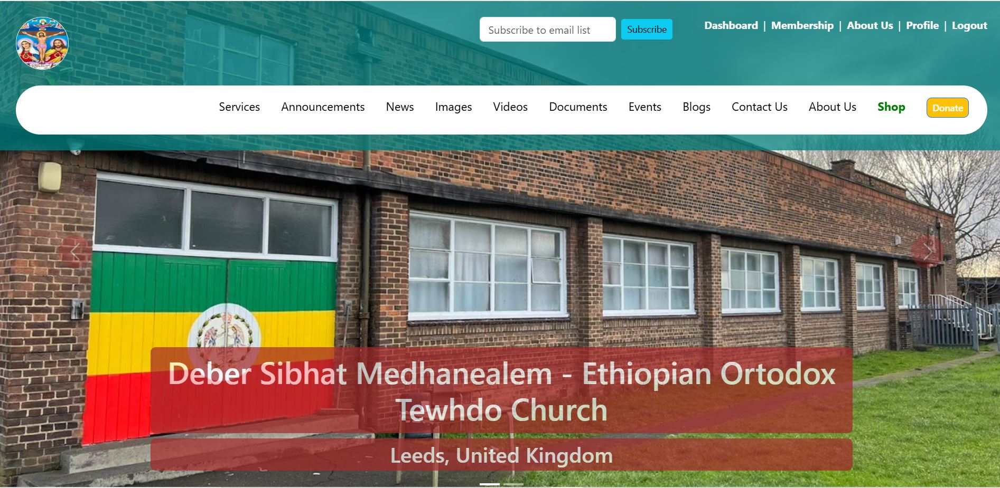
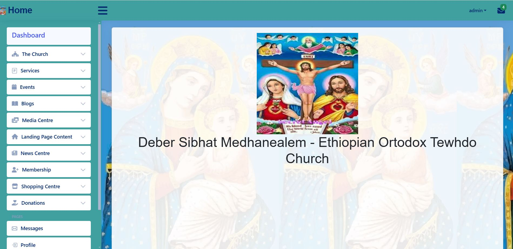
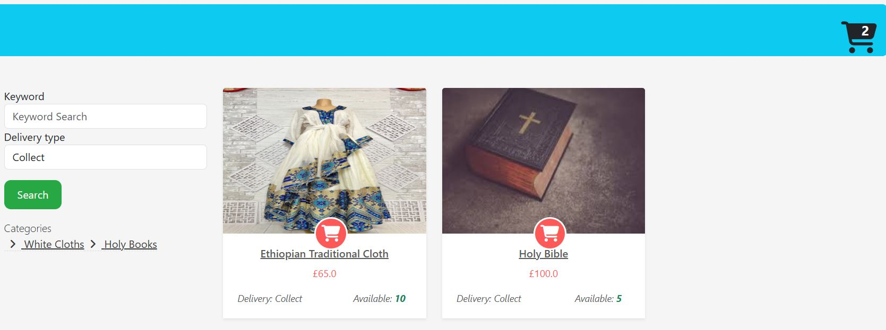
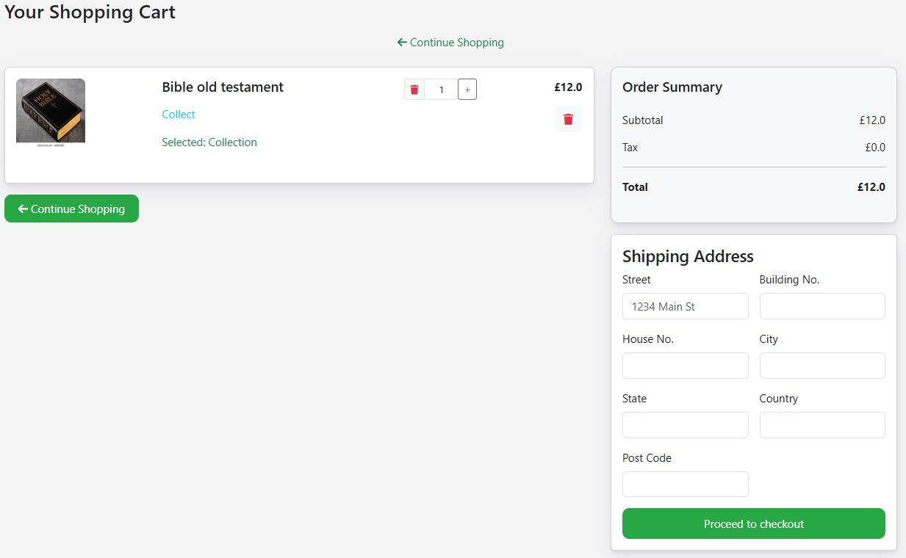
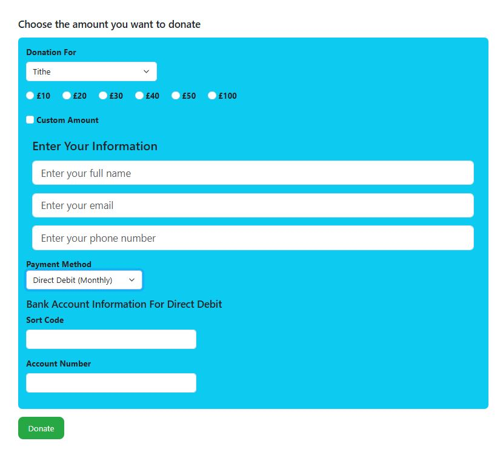

# Configurable fully-dynamic website for EOTC churches with its own dashboard, shopping and cart features

This is a configurable complete website that can be customised and used for Ethiopian Orthodox Church services.

# Programming Languages and Frameworks

## Backend

- **Programming Language** : Java
- **Frameworks** : Spring Boot, Hibernate
- **DB** : MariaDB

## Frontend

- **Templating Language** : Thymeleaf
- HTML, CSS, Bootstrap

## website [Link Here](http://codesofzeki.com/)

# Features

The website has the following features:

- Dashboard
- Online shopping
- User Authentication
- Services
- Blogs
- Announcements
- News
- Images
- Videos
- Documents
- Events
- Contact Us
- About Us
- Membership
- Donation (Using Strip API, Direct Debit and Check)

# Dashboard

# Online Shopping

# Shopping Cart

# Donation

